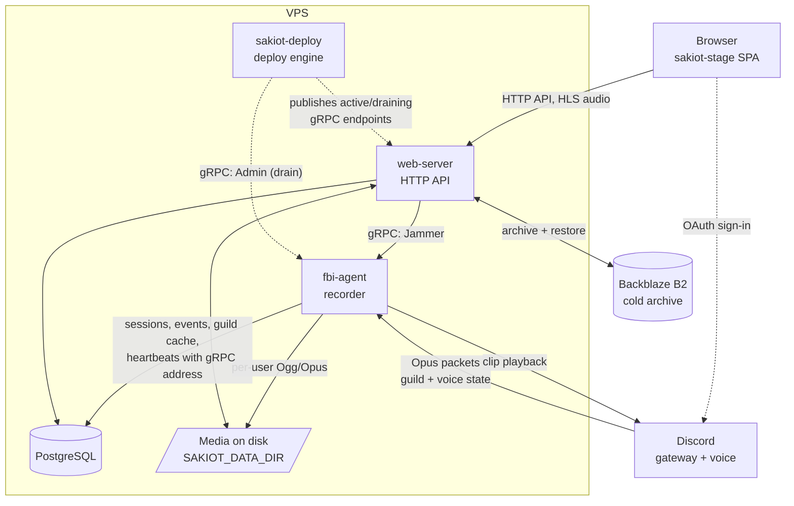

# Architecture

How the pieces fit together and how audio travels from a Discord voice
channel to a clip in a browser. Component setup and operational procedure live
in the component READMEs and [`ops/README.md`](../ops/README.md); this document
is the map that sits above them.

## Components

| Component | Kind | Responsibility |
| --- | --- | --- |
| `fbi-agent` | Rust service | Discord gateway client and voice recorder. The only component that talks to Discord. |
| `web-server` | Rust service | HTTP API, authentication, media rendering and serving, gRPC client to the agent. |
| `sakiot-stage` | React SPA | The user interface. Talks only to `web-server`'s HTTP API. |
| `sakiot-db` | Migrations | Sole owner of the PostgreSQL schema. Neither service migrates at startup. |
| `sakiot-paths` | Rust crate | The filesystem and URL layout, shared so both services agree on where media lives. |
| `sakiot-proto` | Rust crate | The gRPC contract (`fbi_agent.proto`) and its generated types. |
| `sakiot-storage` | Rust crate | Backblaze B2 archive configuration and S3 client. |
| `sakiot-dsp` | Rust crate → native + WASM | Audio effects, compiled both into `web-server` and to WASM for the browser. |
| `ops/sakiot-dev` | Rust CLI | Local development orchestration (`cargo dev`). |
| `ops/sakiot-deploy` | Rust CLI | The deployment engine that runs on the VPS. |

## System shape

Both services run on the same host and share one PostgreSQL database and one
media directory. That shared state, not a message bus, is the primary
integration point — which is why `sakiot-paths` and `sakiot-db` exist as
single owners of the layout and the schema.

## Recording path

1. **Capture.** `fbi-agent` joins a voice channel and Songbird emits a voice
   tick every 20 ms carrying the RTP packets received in that window.
   `voice_receiver/actor/packets.rs` extracts the raw Opus payload from each
   packet, skipping any RTP header extension.
2. **Write.** `events/ogg_opus_writer.rs` writes that payload through
   unmodified, so there is no decode/re-encode cycle in the recording path. It
   batches packets into Ogg pages of about 500 ms (25 packets, within RFC 7845's
   recommended range) behind a buffered file writer. A growing file is readable
   up to its last complete page; a crash loses at most the page in progress and
   the writer's unflushed buffer. One writer per user. On ticks where a tracked
   user produced no packet it writes a pre-encoded 20 ms silent frame instead,
   so each file's timeline matches wallclock and the per-user files stay
   mutually aligned. Discord's frames are stereo 48 kHz at 960 samples. A writer
   whose write fails is closed at once as a writer error.
3. **Track.** The recorder actor (`events/voice_receiver/`) owns the writers and
   the session lifecycle: joins, moves, pauses, policy suspensions, recovery.
   Session and event rows go to PostgreSQL as they happen.
4. **Group.** A *logical recording session* groups the per-user files that
   belong to one sitting in one channel. This is the unit the UI presents and
   the unit deletion and archival operate on.

Files land under `SAKIOT_DATA_DIR` at paths computed by `sakiot-paths`, keyed by
guild, channel, year, month and session timestamp. `web-server` recomputes the
same paths from the same crate rather than reading them from the database.

## Playback path

`web-server` serves audio three ways, all as HLS:

- **Per-user recordings** — one speaker's Ogg/Opus, optionally with silence
  stripped (`audio/silence.rs`).
- **Mixed sessions** — every participant mixed into one timeline
  (`audio/sessions/mix/`), rendered on demand and cached. `occupancy.rs`
  reconstructs who the bot had in the channel across the timeline, so the mix
  and the UI agree on which participants exist when.
- **Live** — a recording still in progress, muxed to HLS while it grows
  (`audio/live.rs`).

Waveform peaks are generated with `audiowaveform` and served alongside, so the
client draws waveforms without downloading the audio.

## Clip editing and the DSP parity story

The clip editor is the one place where the same audio code runs in two
environments. `sakiot-dsp` is compiled twice:

- **Natively**, as a path dependency of `web-server`, to render the final clip.
- **To WASM**, loaded by the frontend into an `AudioWorklet`
  (`features/clip-editor/sharedDspAudioWorklet.ts`) for live preview.

Both sides run the same `SegmentProcessor`, so what the user previews is what
gets rendered. Every stored recording and clip is 48 kHz Opus, and the editor
decodes and plays at 48 kHz whatever the output device's rate, the rate the
renderer uses; the browser converts only the final mix for the device.

User uploads do not exist yet. If they are added, convert each upload once on
arrival to 48 kHz stereo Opus and store only that file, so everything
downstream sees what recordings already provide. The preview and the export
each convert audio on their own, and for other formats they would not quite
agree:

- The browser and ffmpeg resample with different converters.
- The editor reads only the first two channels
  (`features/clip-editor/sharedDsp.ts`), which drops the center of a 5.1 file.
  The export's `-ac 2` downmix mixes it in.
- MP3 and AAC encoder delay can be trimmed differently, moving trims by tens of
  milliseconds.
- Clip cutting copies the Opus stream without re-encoding
  (`web-server/src/clips.rs`).

Every clip access check goes through a channel, so an upload should belong to
a channel the uploader can access and follow that channel's permissions.
Decided with the owner on 2026-09-30. The crate core deliberately has no browser or server
dependencies; the `wasm` feature only adds a thin `wasm-bindgen` boundary.

`sakiot-dsp` is a member of the root Cargo workspace, so the workspace build,
tests, and Clippy cover its native side. A dedicated CI job additionally lints
the `wasm` feature, builds the WASM artifact, and verifies it against native.

## Service-to-service calls

`fbi-agent` serves two gRPC services, defined in
`sakiot-proto/proto/fbi_agent.proto`:

- **`Jammer.JamIt`**, called by `web-server` — play a stored clip back into a
  voice channel. The agent answers with an outcome (queued, not in voice, on
  cooldown, failed) that `web-server` maps onto the error contract below. The
  user's cooldown is spent only once the clip is ready to play.
- **`Admin`**, called by the deploy engine — drain, cancel drain, status,
  shutdown-when-empty, force shutdown. These support zero-downtime deploys: a
  new agent starts, the old one drains until its voice connections are empty,
  then exits.

Every call presents the environment's `FBI_AGENT_REGISTRY_SECRET` in the
`x-fbi-agent-registry-secret` metadata (`sakiot_proto::INTERNAL_SECRET_HEADER`),
which the agent checks in constant time before either service runs
(`fbi-agent/src/grpc/auth.rs`). All environments bind their agents to the same
host's loopback, so reaching the port proves nothing. A release build of the
agent refuses to start without the secret; a debug build runs open for local
development.

`web-server` picks the agent to call per guild from PostgreSQL
(`agent_address_for_guild` in `web-server/src/fbi_agent_registry.rs`). Every
agent heartbeats its gRPC address into `bot_instances`, and
`voice_session_leases` records which instance holds each guild's voice
connection, so during a handover a clip still goes to the draining instance
that is in the channel. The deploy engine also publishes the active and
draining endpoints to an in-memory registry on `web-server`
(`/internal/fbi-agent/grpc-endpoints`, outside `/api`). That registry is only
the fallback when no live heartbeat resolves, and until the first publish it
holds the configured `GRPC_ADDRESS`. When `FBI_AGENT_REGISTRY_SECRET` is set,
the endpoint requires it in the same header, compared in constant time, even
from loopback. Without it, which only local development does, it accepts
loopback callers.

## Authentication and authorization

Users sign in through Discord OAuth. `web-server` issues a JWT in a cookie
(`auth/jwt.rs`, `auth/cookies.rs`) and validates it in middleware. In local
development `/api/dev_login` trades a secret from `.env` for the same cookie,
so Discord is not needed to work on the app; that secret never reaches the
bundle. Each login mints one CSRF token for state-changing requests, and it
stays fixed for that login: `/api/refresh` renews the access and refresh
tokens but keeps it, so tabs refreshing at the same moment cannot invalidate
each other.

Authorization reimplements Discord's permission model against the agent's role
cache rather than trusting the permission snapshot from the OAuth login, so
role and membership revocations take effect without a new login
(`web-server/src/permissions.rs`). The agent writes that cache one guild per
transaction and only where it differs from Discord
(`fbi-agent/src/database/guild_cache.rs`), so a request never sees a guild's
role assignments or overwrites half rewritten. It removes member role
assignments only when its cached member list is complete. On the read side,
each authorization result runs its queries in one `REPEATABLE READ, READ ONLY`
transaction (`begin_snapshot`), so a cache write committing mid-check cannot
mix old and new state. Guild owners are resolved from `guilds.owner_id` or the
agent-maintained `user_guilds.owner` flag. Channel visibility applies `@everyone`, role and member overwrites in
Discord's order. A member can list and play a recording only when they have
VIEW_CHANNEL and CONNECT in every channel it touched. Visibility covers the
channels the agent records: voice (type 2) and stage (type 13). Stage channels
need a Community server, so they are verified by fixture tests only.

Managers (Administrator or MANAGE_GUILD) can preview a guild as one of its
roles (`as_role` on the session tree, live stems, clips and stamps, and the
role view under `/api/admin`). A preview never shows more than the manager's
own view: `role_access_for_preview` keeps only the channels the manager can
view and join, and a session touching any other channel is dropped rather
than shown as hidden. Only Administrator bypasses channel overwrites in
Discord, so this matters for MANAGE_GUILD-only managers; owners and
Administrators see unclipped previews.

## Realtime updates

Dashboards learn about changes from a WebSocket instead of polling. The path
is: committed write → PostgreSQL trigger → `NOTIFY sakiot_realtime` → one
listener per `web-server` process → authorized fan-out → the client refetches
over HTTP. Events are refresh signals that carry identifiers only; data always
comes from the existing authorized endpoints.

- **Triggers** (`sakiot-db/migrations/20261003010000_realtime_notifications.sql`)
  cover recordings, clips, stamps, opt-outs, guild settings and the permission
  cache. They fire for whichever binary writes, including a draining bot.
  Update triggers compare displayed columns only, so heartbeats and no-op
  writes are silent, and permission tables send one guild-wide payload per
  transaction.
- **Listener** (`web-server/src/realtime/listener.rs`) holds a dedicated
  connection and coalesces notifications for 100 ms. A lost connection or a
  notification gap re-authorizes every subscription and sends
  `resync_required`. A self-NOTIFY measures the round trip, and
  `pg_notification_queue_usage` is exported: a full queue fails every
  notifying commit.
- **Authorization** (`web-server/src/realtime/hub.rs`) is cached per
  subscription (viewer, guild, optional role preview) from one consistent
  snapshot (`permissions::subscription_access`) and recomputed on every
  permission event before other events in the batch are routed. Ids go only to
  viewers the HTTP listing would show the item to. A viewer who may have seen
  a session before a change hid it gets an identifier-free `changed` instead.
  Opt-outs reach only their owner, settings only managers, and role previews
  follow the role-preview rule above.
- **Socket** (`GET /api/realtime`, `web-server/src/realtime/socket.rs`)
  accepts only the exact origins in `CORS_ALLOWED_ORIGIN` and
  `OAUTH_ALLOWED_OPENER_ORIGINS`, with no subdomain wildcard. It sends a
  `heartbeat` every 20 s and closes after 60 s of silence, closes with 4001
  when the access token expires and with 4400 for an unsupported protocol
  version, and replaces a backlog of more than 256 messages with one
  `resync_required`. The message types are in the OpenAPI document, so the
  frontend's generated types cover them.
- **Shutdown**: on SIGTERM the server closes every socket with 1012 at once,
  then gives in-flight HTTP requests 5 s. actix's default handling waited the
  full 30 s for open sockets.
- **Switch**: `REALTIME_ENABLED` (default off) turns on the listener and the
  endpoint; `GET /api/users/current` reports it as `realtime_enabled`, and
  clients keep polling while it is off or the socket keeps failing.
  Enabling it per environment needs nginx to forward WebSocket upgrades and
  the CSP to allow the socket; see [`ops/README.md`](../ops/README.md).
- **Targeted refresh**: `GET /api/current/{guild}/sessions/{session}` returns
  one session's tree entry, or null when it is missing, deleted or not visible,
  so a `changed` event refreshes one session instead of the whole tree.
- **Client** (`sakiot-stage/src/realtime/`): one coordinator per tab owns the
  socket, follows the route's guild and role preview, and turns events into
  RTK Query updates (a targeted session patch, or tag invalidation). It renews
  the access token before expiry on a replacement socket. After repeated
  failures it falls back to polling the tree, live stems, clips and stamps
  every 30 s. Manifests (every 5 s until finalized) and a file's live state
  (every 10 s) poll even while realtime is live: a growing recording changes
  only its heartbeat, which notifies nothing, so no event announces new
  audio. Settings forms
  keep an admin's draft when a refresh changes the saved value
  (`shared/useDraftField.ts`).

### Members and voice presence

The agent keeps two projections of its gateway cache: `guild_members`, the
current roster, and `voice_presence`, who is in which voice or stage channel
(`sakiot-db/migrations/20261004000000_member_presence_projections.sql`,
`fbi-agent/src/projections.rs`). They are not used for authorization yet;
`user_guilds` still decides membership.

- **Ownership**: one instance writes a guild's projections, recorded in
  `guild_projection_state` with a generation. Every write locks that row and
  checks owner and generation, then writes what serenity's cache holds now,
  so writes are order-insensitive and a superseded writer is fenced out. A
  replacement claims a guild only from a complete snapshot, by bumping the
  generation; until then the incumbent keeps writing, even while draining.
  A draining instance never claims. A stopping instance releases what it
  still owns, which makes presence unknown rather than frozen.
- **Completeness**: Discord sends every member in GUILD_CREATE only below
  `large_threshold` (250). Above it the agent requests member chunks, one
  guild at a time with a 1 s gap, and claims the guild once the full chunk
  set arrives (`ChunkSet`). A guild whose request times out is retried at the
  next 15-minute refresh. Absence from an incomplete roster is never a
  departure: members are removed only by a member-remove event or a complete
  snapshot.
- **Presence** (`GET /api/current/{guild}/voice-presence`, `web-server/src/presence.rs`):
  every member sees who is in the voice and stage channels they can view.
  VIEW_CHANNEL is enough, as in Discord's channel list. Role previews follow
  the role-preview rule, clipped to the manager's own presence view. The
  response says `available: false` while no running agent owns the guild (a
  first rollout, a stopped or crashed owner), so clients show "unknown"
  instead of empty channels.
- **Events**: `presence` and `members` payloads carry only the guild. Every
  subscriber refetches its own filtered presence, so a move into a hidden
  channel looks like leaving and nobody learns about channels they cannot
  view. `members` goes to managers only.
- **Members** (`GET /api/admin/guilds/{guild}/members`): manager-only search
  by name or the start of an id, at most 50 per page and offsets up to 1000.
  `@everyone`'s member count and list come from the roster; the count is
  null until a roster has been complete once.
- **Client**: the recordings sidebar shows an "In voice" panel. It polls
  every 10 s without realtime, and every 60 s with it, because a crashed
  agent sends no event. Per-user cooldown overrides have a member picker
  next to manual id entry.

## Recording controls

Recording is on by default. Two controls narrow it, and both are enforced in
one place, `create_fragment_in` (`fbi-agent/src/database/logical_recordings.rs`),
under the guild's advisory lock:

- **Channel exclusions**, set by guild managers in the recording policy.
- **Member opt-outs** (`recording_opt_outs`), set per server by members
  themselves with `/recording opt-out` or the web app's account menu.

The recorder re-checks both once per second, closes writers as soon as either
applies, and suspends recording when it cannot read them. Opting out keeps
earlier recordings.

## Media lifecycle

Recordings age out of local disk into Backblaze B2:

- `media_archive/worker.rs` uploads eligible media and records it in
  `media_objects`; `spawn_local_cleanup` reclaims local copies afterwards.
- `media_archive/serve.rs` decides per request whether to serve locally or
  restore from B2 first (`RemoteDisposition`).
- Deletion is a job (`recording_deletion.rs`, `recording_deletion_jobs`),
  soft by default, so an accidental delete is recoverable.

The archive is disabled by default locally. An enabled deployment requires
every `SAKIOT_MEDIA_S3_*` value and fails startup on partial configuration
rather than silently running without an archive. See
[`ops/B2_MEDIA_ARCHIVE.md`](../ops/B2_MEDIA_ARCHIVE.md).

## Contracts that are enforced, not documented

Four cross-component contracts are checked mechanically, which is why they do
not drift:

- **HTTP API → frontend types.** `web-server` emits an OpenAPI document at
  compile time; `bun run generate:api-types` derives the TypeScript from it and
  `check:api-types` fails CI when the checked-in types are stale.
- **Errors → users.** Every API error body is `{ code, kind, message }`
  (`web-server/src/errors.rs`), plus `retry_after_seconds` on a rate-limited
  (429) response. Unknown `/api` paths answer the same way. The one deliberate
  exception is a 409 from channel-mix generation, which returns the mix status
  document so the page can keep showing the tracks it found. `kind` is a stable
  `ErrorKind` that reaches the frontend through the same generated types;
  `message` is always safe to show, while SQL, paths, subprocess output, and
  upstream bodies are only logged.
  Background jobs persist the kind in `error_kind` and derive their displayed
  text from it, so legacy free-form `error` text is never returned. Retry
  decisions are made on types, never on wording. The frontend normalizes every
  failure (contract bodies, older bodies without `kind`, network failures,
  malformed responses) through `sakiot-stage/src/app/apiError.ts`.
- **SQL → Rust.** Every fixed production statement in `web-server` and
  `fbi-agent` is a `query!`/`query_as!`/`query_scalar!` macro, which SQLx
  verifies against the real schema at compile time. The metadata is committed
  in `.sqlx`, refreshed by `scripts/sqlx-prepare.sh` against a disposable
  database, and the pre-commit hook re-checks it when migrations or
  SQLx-using files are staged. The deliberate runtime-checked exceptions are
  variable-arity multi-row inserts built with `QueryBuilder` (`user_guilds`
  in `web-server/src/user.rs`), the `sakiot-dev`
  tooling that runs caller-supplied SQL against arbitrary databases, and test
  fixtures.
- **Version → release.** `[workspace.package] version` is the only release
  trigger. Bumping it and merging tags `v<version>`, which deploys to
  production. See [`ops/README.md`](../ops/README.md) and
  [`STAGING.md`](../STAGING.md).

Because the services share `sakiot-paths`, `sakiot-proto` and one schema, a
change that spans a contract is one atomic commit rather than a coordinated
rollout. That is the main reason this is a monorepo.

## Where things run

Pushes to `main` deploy to staging; a version bump promotes to production after
staging verifies; branch pushes can get a preview slot. Rollback is a workflow.
The deploy engine is `ops/sakiot-deploy`, a typed Rust CLI rather than a shell
script. Details in [`ops/README.md`](../ops/README.md),
[`STAGING.md`](../STAGING.md) and [`PREVIEW.md`](../PREVIEW.md).
