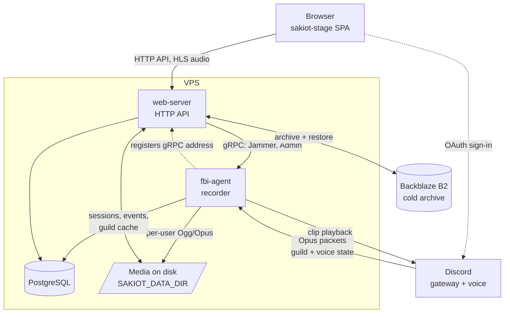

# Architecture

How the pieces fit together and how audio travels from a Discord voice
channel to a clip in a browser. Component setup and operational procedure live
in the component READMEs and [`ops/README.md`](../ops/README.md); this document
is the map that sits above them.

## Components

| Component | Kind | Responsibility |
| --- | --- | --- |
| `fbi-agent` | Rust service | Discord gateway client and voice recorder. The only component that talks to Discord. |
| `web-server` | Rust service | HTTP API, authentication, media rendering and serving, gRPC client to the agent. |
| `sakiot-stage` | React SPA | The user interface. Talks only to `web-server`'s HTTP API. |
| `sakiot-db` | Migrations | Sole owner of the PostgreSQL schema. Neither service migrates at startup. |
| `sakiot-paths` | Rust crate | The filesystem and URL layout, shared so both services agree on where media lives. |
| `sakiot-proto` | Rust crate | The gRPC contract (`fbi_agent.proto`) and its generated types. |
| `sakiot-storage` | Rust crate | Backblaze B2 archive configuration and S3 client. |
| `sakiot-dsp` | Rust crate → native + WASM | Audio effects, compiled both into `web-server` and to WASM for the browser. |
| `ops/sakiot-dev` | Rust CLI | Local development orchestration (`cargo dev`). |
| `ops/sakiot-deploy` | Rust CLI | The deployment engine that runs on the VPS. |

## System shape

Both services run on the same host and share one PostgreSQL database and one
media directory. That shared state, not a message bus, is the primary
integration point — which is why `sakiot-paths` and `sakiot-db` exist as
single owners of the layout and the schema.

## Recording path

1. **Capture.** `fbi-agent` joins a voice channel and Songbird emits a voice
   tick every 20 ms carrying the RTP packets received in that window.
   `voice_receiver/actor/packets.rs` extracts the raw Opus payload from each
   packet, skipping any RTP header extension.
2. **Write.** `events/ogg_opus_writer.rs` writes that payload through
   unmodified - one Opus packet per Ogg page, so a partially written file is
   always playable, and no decode/re-encode cycle in the recording path. One
   writer per user. On ticks where a tracked user produced no packet it writes a
   pre-encoded 20 ms silent frame instead, so each file's timeline matches
   wallclock and the per-user files stay mutually aligned. Discord's frames are
   stereo 48 kHz at 960 samples.
3. **Track.** The recorder actor (`events/voice_receiver/`) owns the writers and
   the session lifecycle: joins, moves, pauses, policy suspensions, recovery.
   Session and event rows go to PostgreSQL as they happen.
4. **Group.** A *logical recording session* groups the per-user files that
   belong to one sitting in one channel. This is the unit the UI presents and
   the unit deletion and archival operate on.

Files land under `SAKIOT_DATA_DIR` at paths computed by `sakiot-paths`, keyed by
guild, channel, year, month and session timestamp. `web-server` recomputes the
same paths from the same crate rather than reading them from the database.

## Playback path

`web-server` serves audio three ways, all as HLS:

- **Per-user recordings** — one speaker's Ogg/Opus, optionally with silence
  stripped (`audio/silence.rs`).
- **Mixed sessions** — every participant mixed into one timeline
  (`audio/sessions/mix/`), rendered on demand and cached. `occupancy.rs`
  reconstructs who the bot had in the channel across the timeline, so the mix
  and the UI agree on which participants exist when.
- **Live** — a recording still in progress, muxed to HLS while it grows
  (`audio/live.rs`).

Waveform peaks are generated with `audiowaveform` and served alongside, so the
client draws waveforms without downloading the audio.

## Clip editing and the DSP parity story

The clip editor is the one place where the same audio code runs in two
environments. `sakiot-dsp` is compiled twice:

- **Natively**, as a path dependency of `web-server`, to render the final clip.
- **To WASM**, loaded by the frontend into an `AudioWorklet`
  (`features/clip-editor/sharedDspAudioWorklet.ts`) for live preview.

Both sides run the same `SegmentProcessor`, so what the user previews is what
gets rendered. The crate core deliberately has no browser or server
dependencies; the `wasm` feature only adds a thin `wasm-bindgen` boundary.

`sakiot-dsp` is a member of the root Cargo workspace, so the workspace build,
tests, and Clippy cover its native side. A dedicated CI job additionally lints
the `wasm` feature, builds the WASM artifact, and verifies it against native.

## Service-to-service calls

`web-server` calls `fbi-agent` over gRPC — the contract is
`sakiot-proto/proto/fbi_agent.proto`:

- **`Jammer.JamIt`** — play a stored clip back into a voice channel.
- **`Admin`** — drain, cancel drain, status, shutdown-when-empty, force
  shutdown. These support zero-downtime deploys: a new agent starts, the old
  one drains until its voice connections are empty, then exits.

The agent's gRPC address is not configured into `web-server`. The agent
registers it at runtime (`web-server/src/fbi_agent_registry.rs`), authenticated
by a shared secret header and compared in constant time. The registry tracks
one active instance plus any draining ones, which is what makes the drain
handover work.

## Authentication and authorization

Users sign in through Discord OAuth. `web-server` issues a JWT in a cookie
(`auth/jwt.rs`, `auth/cookies.rs`) and validates it in middleware. In local
development `/api/dev_login` trades a secret from `.env` for the same cookie,
so Discord is not needed to work on the app; that secret never reaches the
bundle.

Authorization reimplements Discord's permission model against the agent's role
cache rather than trusting the permission snapshot from the OAuth login, so
role and membership revocations take effect without a new login
(`web-server/src/permissions.rs`). Guild owners are resolved from `guilds.owner_id` or the
agent-maintained `user_guilds.owner` flag. Channel visibility applies `@everyone`, role and member overwrites in
Discord's order.

## Media lifecycle

Recordings age out of local disk into Backblaze B2:

- `media_archive/worker.rs` uploads eligible media and records it in
  `media_objects`; `spawn_local_cleanup` reclaims local copies afterwards.
- `media_archive/serve.rs` decides per request whether to serve locally or
  restore from B2 first (`RemoteDisposition`).
- Deletion is a job (`recording_deletion.rs`, `recording_deletion_jobs`),
  soft by default, so an accidental delete is recoverable.

The archive is disabled by default locally. An enabled deployment requires
every `SAKIOT_MEDIA_S3_*` value and fails startup on partial configuration
rather than silently running without an archive. See
[`ops/B2_MEDIA_ARCHIVE.md`](../ops/B2_MEDIA_ARCHIVE.md).

## Contracts that are enforced, not documented

Four cross-component contracts are checked mechanically, which is why they do
not drift:

- **HTTP API → frontend types.** `web-server` emits an OpenAPI document at
  compile time; `bun run generate:api-types` derives the TypeScript from it and
  `check:api-types` fails CI when the checked-in types are stale.
- **Errors → users.** Every API error body is `{ code, kind, message }`
  (`web-server/src/errors.rs`). `kind` is a stable `ErrorKind` that reaches the
  frontend through the same generated types; `message` is always safe to show,
  while SQL, paths, subprocess output, and upstream bodies are only logged.
  Background jobs persist the kind in `error_kind` and derive their displayed
  text from it, so legacy free-form `error` text is never returned. Retry
  decisions are made on types, never on wording. The frontend normalizes every
  failure (contract bodies, older bodies without `kind`, network failures,
  malformed responses) through `sakiot-stage/src/app/apiError.ts`.
- **SQL → Rust.** Every fixed production statement in `web-server` and
  `fbi-agent` is a `query!`/`query_as!`/`query_scalar!` macro, which SQLx
  verifies against the real schema at compile time. The metadata is committed
  in `.sqlx`, refreshed by `scripts/sqlx-prepare.sh` against a disposable
  database, and the pre-commit hook re-checks it when migrations or
  SQLx-using files are staged. The deliberate runtime-checked exceptions are
  variable-arity multi-row inserts built with `QueryBuilder` (the bot's guild
  cache sync and `user_guilds` in `web-server/src/user.rs`), the `sakiot-dev`
  tooling that runs caller-supplied SQL against arbitrary databases, and test
  fixtures.
- **Version → release.** `[workspace.package] version` is the only release
  trigger. Bumping it and merging tags `v<version>`, which deploys to
  production. See [`ops/README.md`](../ops/README.md) and
  [`STAGING.md`](../STAGING.md).

Because the services share `sakiot-paths`, `sakiot-proto` and one schema, a
change that spans a contract is one atomic commit rather than a coordinated
rollout. That is the main reason this is a monorepo.

## Where things run

Pushes to `main` deploy to staging; a version bump promotes to production after
staging verifies; branch pushes can get a preview slot. Rollback is a workflow.
The deploy engine is `ops/sakiot-deploy`, a typed Rust CLI rather than a shell
script. Details in [`ops/README.md`](../ops/README.md),
[`STAGING.md`](../STAGING.md) and [`PREVIEW.md`](../PREVIEW.md).
